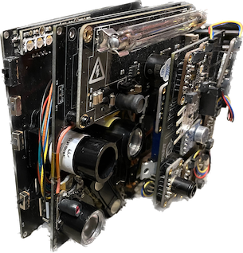

# Tricorder-ESP32
A portable low-power sensor server for my tricorder project
## About
Using the Adafruit Feather ESP32 V2 microcontroller board to read various sensor data through I2C, digital, and analog read. Programmed in C & C++ via Arduino IDE. 

## Architecture
The MCU board, sensors, and other electrical components are placed on three custom double-layered PCBs, stacked vertically to make one complete circuit. Modular design allows for each PCB to be used independently when needed.

Two 128x64 OLED displays provide status (battery percentage, charging time, current GPS time, etc.) and basic sensor readings. Four capacitive touch pads on the PCB allow for a simple and quick menu-based user interface. 

## Power Supply
The device is powered by its own 2500mAh LiPo battery and power supply + charging circuitry. Uses a buck/boost converter to regulate power safely. NMOS transistors switch power to unused circuit components. It also features a deep sleep mode for conserving power.

Can measure its own current and voltage supply or be used as a multimeter for reading external current, voltage, and power.

## Communication
A RaspberryPi communicates with the ESP32 through serial link (USB or bluetooth) and visualizes the requested data in real time. The RaspberryPi also integrates a Software Defined Radio (SDR) module and an IR-CUT camera. 

## Parts

### Sensors
- AS7341 10-channel photo spectrometer
- LTR390 UV sensor
- TSL2591 infrared + visible light sensor
- HTU31D temperature + humidity sensor
- BMP388 barometric pressure sensor
- SGP30 volatile organic compunds + CO2 sensor
- MLX90640 IR thermal camera
- MAX9814 electret microphone amplifier with auto gain control (noise)
- Modern Devices Rev. C wind speed sensor
- BNO055 9-DOF absolute orientation inertial measurement unit
- PMSA003I particulate matter (dust) sensor
- DFRobot Geiger counter (ionizing radiation)
- Garmin LIDAR-Lite V3 optical distance sensor
- BN880 GPS/GLONASS/Beidou positioning sensor
- INA260 voltage, current, power sensor
- Force-Sensitive Resistor (FSR) - Alpha MF02A-N-221-A01 (weight)

### User Interface Components
- Two 128x64 OLED displays
- Capacitive touch pads
- LED RGBW strip (8x neopixels)
 
### Other Electrical Components
- PowerBoost 1000 Basic 5V buck/boost convertor
- LC709203F LiPo fuel gauge + battery monitor
- LTC4311 active I2C extender and terminator
- ISO1540 Bidirectional I2C Isolator
- Resistors (assorted)
- Transistors (NMOS)
- Slide switches (SPDT)
- Momentary push buttons
- Stacking headers
- 2500mAh LiPo battery with 10KΩ thermistor
- Magnetic pin back (for camera)
- IR LED blaster
- Adafruit USB Type C breakout board
- Custom double-layer PCBs (vendor: jlcpcb)

[]

[]